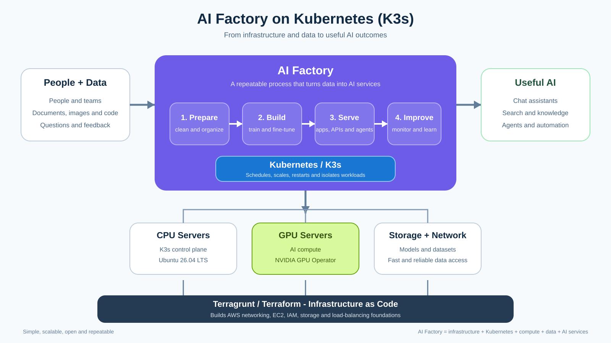

# AI Factory on Kubernetes

> **Research review:** 2026-09-13. This guide reflects the current repository architecture and current upstream documentation for Ubuntu on AWS, NVIDIA AI Factory / AI Enterprise, NVIDIA GPU Operator, Kubernetes, Kubeflow, KServe, KubeRay, Kueue and MLflow.



The diagram above is deliberately simple: **Terragrunt builds the foundation, Kubernetes/K3s runs the factory, CPU/GPU machines provide compute, and AI services turn data into useful outputs.**

## Repository guide

This repository is the AI Factory: an AWS/K3s Kubernetes substrate built with Terragrunt, plus the research and Helm guides for the AI platform layers that run on it.

| Start here | What it covers |
|---|---|
| [`docs/platform/README.md`](docs/platform/README.md) | Deploying the K3s substrate on AWS with Terragrunt: VPC, EC2, K3s, Traefik, cert-manager, Argo CD |
| [`docs/terragrunt-workflow/README.md`](docs/terragrunt-workflow/README.md) | Backend bootstrap, `run --all` DAG, state and migration workflow |
| [`VERSIONS.md`](VERSIONS.md) | Pinned Ubuntu, K3s, provider and Helm chart versions |
| [`docs/ai-factory/kubernetes-distribution-recommendation.md`](docs/ai-factory/kubernetes-distribution-recommendation.md) | RKE2 vs K3s vs upstream Kubernetes vs OpenShift for a production AI Factory |
| [`docs/ai-factory/inference-workloads.md`](docs/ai-factory/inference-workloads.md) | Serving models on Kubernetes: GPU integration, vLLM, KServe, KubeRay |
| [`docs/ai-factory/llm-gateway/README.md`](docs/ai-factory/llm-gateway/README.md) | LiteLLM LLM gateway, plus the Traefik [Gateway API](docs/ai-factory/llm-gateway/gateway-api.md) path |
| [`docs/ai-factory/agent-gateway/README.md`](docs/ai-factory/agent-gateway/README.md) | AgentGateway: Gateway API-native gateway for LLM, MCP and A2A traffic, and when to prefer it over LiteLLM |
| [`docs/ai-factory/llm-kube/README.md`](docs/ai-factory/llm-kube/README.md) | LLMKube operator evaluation |
| [`docs/ai-factory/mcp-gateway/README.md`](docs/ai-factory/mcp-gateway/README.md) | IBM ContextForge MCP gateway |
| [`docs/ai-factory/ai-playground/README.md`](docs/ai-factory/ai-playground/README.md) | Local AI playground on an Apple Silicon Mac: minikube + krunkit with GPU-scheduled pods |
| [`docs/README.md`](docs/README.md) | Full documentation index and Terragrunt unit layout |

```text
.
├── README.md              # this guide
├── VERSIONS.md
├── docs/
│   ├── platform/          # K3s platform deployment guide
│   ├── ai-factory/        # AI platform research and Helm guides
│   ├── terragrunt-workflow/
│   ├── diagrams/
│   ├── k3s/
│   ├── k3s-vs-kubeadm/
│   └── kubernetes-platform-comparison/
├── infrastructure/
│   ├── modules/           # vpc, ec2, k3s, helm-release
│   ├── templates/         # K3s user-data bootstrap
│   └── live/              # Terragrunt units: root.hcl, _common, dev/us-east-1
└── kubernetes/helm/       # Traefik, cert-manager, Argo CD chart values
```

## Executive summary

An **AI factory** is not one product, one GPU server, one LLM, or one Kubernetes cluster. It is a repeatable platform that turns **data + compute + models + software** into production AI capabilities and then uses monitoring and feedback to improve the next iteration.

A useful mental model is:

```text
People + data
     |
     v
Prepare data
     |
     v
Train / fine-tune / evaluate
     |
     v
Package / register models
     |
     v
Deploy / serve / scale
     |
     v
Observe / govern / collect feedback
     |
     +-----------------------------> next iteration
```

Kubernetes is a strong foundation for this platform because it gives one control plane for CPU and GPU workloads, scheduling, self-healing, isolation, operators, policy, services, rollouts and scaling.

**Yes, K3s can be used to build an AI factory.** It is a conformant Kubernetes distribution and can run Kubernetes-native AI components when their version, OS, GPU, driver, networking and storage requirements are satisfied.

For this repository the baseline is now:

```text
AWS
└── Ubuntu Server 26.04 LTS
    └── K3s v1.36.4+k3s1
        ├── Traefik
        ├── cert-manager
        ├── Argo CD
        └── application / AI workloads
```

Ubuntu 26.04 LTS is the latest Ubuntu LTS release as of this review. The repository resolves Canonical's latest regional AMD64 gp3 image through this AWS public SSM parameter:

```text
/aws/service/canonical/ubuntu/server/26.04/stable/current/amd64/hvm/ebs-gp3/ami-id
```

Canonical Ubuntu-on-AWS reference:
<https://ubuntu.com/aws/docs/aws-how-to/instances/find-ubuntu-images/>

Ubuntu 26.04 LTS release announcement:
<https://canonical.com/blog/canonical-releases-ubuntu-26-04-lts-resolute-raccoon>

---

## 1. What does "AI factory" mean?

Think of a traditional factory:

```text
raw material -> production line -> quality checks -> finished product
```

An AI factory applies the same idea to AI:

```text
data -> AI/ML pipeline -> evaluation -> model/service -> production feedback
```

The platform normally includes several layers:

```text
Facilities / cloud capacity
        |
Compute + accelerators
        |
Network + storage
        |
Operating system + drivers
        |
Kubernetes
        |
GPU / network / storage operators
        |
ML / data / model-serving platform
        |
GitOps + security + observability
        |
AI applications / models / agents
```

NVIDIA's current AI Factory guidance similarly treats compute, networking, storage, Kubernetes, accelerated infrastructure software, observability, security and AI software as one coordinated system.

Official references:

- NVIDIA Enterprise AI Factory overview: <https://docs.nvidia.com/ai-enterprise/planning-resource/ai-factory-white-paper/latest/ai-factory-overview.html>
- NVIDIA AI Factory ecosystem architecture: <https://docs.nvidia.com/ai-enterprise/planning-resource/ai-factory-white-paper/latest/ecosystem-architecture.html>
- NVIDIA AI Factory deployment strategies: <https://docs.nvidia.com/ai-enterprise/planning-resource/ai-factory-white-paper/latest/deployment-strategies.html>

### What is not an AI factory by itself?

A few GPUs are **compute capacity**.

A Kubernetes cluster is **an orchestration layer**.

An inference server is **one workload**.

A notebook environment is **one development tool**.

The AI factory appears when these become a repeatable operational platform with lifecycle management, automation, observability, security and feedback.

---

## 2. Where Kubernetes fits

Kubernetes sits between infrastructure capacity and AI workloads.

It answers questions such as:

- Which machine should run this workload?
- Does this job need CPU, memory or GPU?
- What happens if the process crashes?
- Which team is allowed to use which resources?
- How do we deploy a new model version safely?
- How do we expose a model API?
- How do we scale inference replicas?
- How do we queue expensive training jobs?

Typical mappings are:

| AI-factory need | Kubernetes capability |
|---|---|
| Place workloads | scheduler, labels, affinity, taints/tolerations |
| Allocate GPUs | device plugins / Dynamic Resource Allocation |
| Separate teams | namespaces, RBAC, quotas, policy |
| Recover failed services | controllers and self-healing |
| Deploy model versions | Deployments, operators, GitOps |
| Training/batch | Jobs plus Kueue or another batch scheduler |
| Inference APIs | Services, Gateway/Ingress, KServe, Ray Serve |
| Persistent data | CSI, PersistentVolumes, object storage integrations |
| GPU software lifecycle | NVIDIA GPU Operator |
| Metrics | Prometheus, OpenTelemetry, DCGM Exporter |

Kubernetes Dynamic Resource Allocation is now stable and gives Kubernetes a richer way to allocate hardware devices such as accelerators.

Official references:

- Kubernetes DRA: <https://kubernetes.io/docs/concepts/resource-management/dynamic-resource-allocation/>
- Kubernetes resource management: <https://kubernetes.io/docs/concepts/configuration/manage-resources-containers/>

---

## 3. Can K3s be used for an AI factory?

**Yes.**

K3s uses normal Kubernetes APIs and runs Kubernetes workloads with containerd. Kubernetes-native AI operators and services generally care about:

- Kubernetes API compatibility;
- Linux/kernel compatibility;
- container runtime;
- GPU driver/runtime compatibility;
- device exposure;
- storage interfaces;
- networking capabilities;
- exact supported versions.

They do not generally require the control plane to have been created specifically by kubeadm.

### Strong current evidence: NVIDIA GPU Operator

NVIDIA's current GPU Operator platform-support matrix includes **K3s** and validates K3s on Ubuntu releases including Ubuntu 26.04 for supported Kubernetes version ranges. This repository currently pins K3s `v1.36.4+k3s1`, so the Kubernetes version is in the current documented K3s range for GPU Operator `26.7.x` at the time of this review.

Always re-check the current matrix before deploying production GPU nodes because NVIDIA updates the validated combinations independently of this repository.

Official references:

- NVIDIA GPU Operator: <https://docs.nvidia.com/datacenter/cloud-native/gpu-operator/latest/>
- GPU Operator platform support: <https://docs.nvidia.com/datacenter/cloud-native/gpu-operator/latest/platform-support.html>
- GPU Operator getting started: <https://docs.nvidia.com/datacenter/cloud-native/gpu-operator/latest/getting-started.html>

### Why Ubuntu 26.04 LTS improves this repository's AI direction

The previous repository baseline used Amazon Linux 2023. The current baseline uses **Ubuntu Server 26.04 LTS**.

That provides a more natural path for an NVIDIA-oriented AI worker design because Ubuntu appears directly in NVIDIA's current Kubernetes/GPU validation documentation and Canonical positions Ubuntu 26.04 LTS as an AI/ML-ready LTS release.

This does **not** mean every GPU, driver and library combination is automatically supported. Production qualification still needs the exact matrix:

```text
Ubuntu release
+ kernel
+ Kubernetes/K3s release
+ NVIDIA driver branch
+ GPU Operator release
+ GPU model
+ container runtime
= validated platform combination
```

---

## 4. Current repository architecture

The current repository is still intentionally small:

```text
Terragrunt
    |
    +--> VPC
    |
    +--> EC2
           Ubuntu 26.04 LTS
           K3s server + worker
    |
    +--> K3s kubeconfig retrieval
    |
    +--> Traefik
    |
    +--> cert-manager
    |
    +--> Argo CD
```

Important characteristics:

- Terragrunt is the operator interface.
- Terraform creates AWS resources underneath Terragrunt.
- EC2 nodes are map-driven using `for_each`.
- K3s is installed through EC2 user data/cloud-init.
- SSH is not required.
- AWS Systems Manager is used to retrieve kubeconfig securely.
- K3s's bundled Traefik is disabled and the official chart is managed separately.
- The current profile is a single K3s server/worker and therefore **not node-level HA**.

The current `t3.medium` profile is useful for the platform/control-plane path, not as a serious AI training machine.

---

## 5. Recommended AI-factory evolution

Do not turn every Kubernetes node into an expensive GPU machine.

A clean production direction is:

```text
                         stable API endpoint
                                |
                +---------------+---------------+
                |               |               |
          K3s server 1     K3s server 2     K3s server 3
          Ubuntu CPU       Ubuntu CPU        Ubuntu CPU
          control plane    control plane     control plane
          embedded etcd    embedded etcd     embedded etcd
                |               |               |
                +------- control-plane HA ------+
                                |
             +------------------+------------------+
             |                                     |
        CPU workers                           GPU workers
 platform / normal apps                       AI workloads
                                                   |
                                          GPU Operator
                                          DCGM telemetry
                                          model runtimes
```

Then add platform services according to need:

```text
Kubernetes
├── GPU lifecycle
│   └── NVIDIA GPU Operator
├── scheduling / quotas
│   └── Kueue
├── AI / ML workflows
│   └── Kubeflow components
├── experiment / model tracking
│   └── MLflow
├── distributed compute
│   └── KubeRay / Ray
├── model serving
│   └── KServe / Ray Serve / custom runtime
├── observability
│   └── Prometheus / Grafana / OpenTelemetry / DCGM
└── GitOps
    └── Argo CD
```

This architecture lets expensive GPU capacity scale independently of the control plane.

---

## 6. What Terragrunt should manage vs what Kubernetes should manage

For this repository, keep a clear ownership boundary.

### Terragrunt / Terraform: infrastructure substrate

Use Terragrunt/Terraform for:

- VPC and subnets;
- security groups;
- IAM roles and policies;
- CPU EC2 instances;
- GPU EC2 instances;
- EBS volumes;
- object-storage infrastructure;
- load balancers / static infrastructure endpoints;
- DNS/cloud resources where appropriate.

### Kubernetes / operators / GitOps: platform software

Use Kubernetes for:

- GPU Operator;
- network/storage operators;
- Kueue;
- Kubeflow components;
- KServe;
- KubeRay;
- MLflow deployments;
- Prometheus / Grafana / OpenTelemetry;
- model services;
- training jobs;
- inference services;
- application configuration.

### Can Kubernetes create cloud infrastructure too?

Yes. Projects such as Crossplane and Cluster API can expose external infrastructure through Kubernetes APIs.

That is technically valid, but it should not automatically replace Terragrunt here.

If the same AI cluster is required to exist before it can recreate its own VPC, machines, IAM and recovery path, disaster recovery becomes harder to reason about.

A simpler hierarchy is:

```text
Terragrunt creates infrastructure
        |
        v
Kubernetes exists
        |
        v
Operators build the AI platform
        |
        v
AI workloads run
```

Crossplane: <https://www.crossplane.io/>

Cluster API: <https://cluster-api.sigs.k8s.io/>

---

## 7. AI platform building blocks

You do not need every project below. Install a component only when it solves a concrete requirement.

### NVIDIA GPU Operator

Automates the Kubernetes software stack needed to expose NVIDIA GPUs, including driver/runtime/device-management components depending on configuration.

- <https://docs.nvidia.com/datacenter/cloud-native/gpu-operator/latest/>

### NVIDIA Network Operator

Useful for advanced NVIDIA networking and high-performance multi-node GPU communication, including environments involving RDMA/GPUDirect RDMA.

- <https://docs.nvidia.com/networking/display/kubernetes2670/index.html>

For one-GPU-node inference, this may be unnecessary complexity.

### Kueue

Kubernetes-native job admission, quotas, queues and fair sharing. Very useful when several teams compete for expensive accelerators.

- <https://kueue.sigs.k8s.io/>

### Kubeflow

A modular cloud-native AI/ML platform built around Kubernetes-native projects.

- <https://www.kubeflow.org/docs/started/introduction/>
- <https://www.kubeflow.org/docs/started/installing-kubeflow/>

Do not deploy every Kubeflow component by default; select only what the platform needs.

### KServe

Kubernetes-native model inference platform for predictive and generative serving patterns.

- <https://kserve.github.io/website/docs/admin-guide/overview>
- <https://kserve.github.io/website/docs/getting-started/quickstart-guide>

### KubeRay / Ray

Useful for distributed Python, data processing, training and Ray Serve workloads.

- <https://docs.ray.io/en/latest/cluster/kubernetes/index.html>
- <https://docs.ray.io/en/latest/cluster/kubernetes/getting-started.html>

### MLflow

Experiment tracking, model lifecycle and related ML platform capabilities.

- <https://mlflow.org/docs/latest/>

### Observability

At minimum, an AI platform should monitor both application behavior and accelerator behavior.

Useful projects include:

- Prometheus: <https://prometheus.io/docs/introduction/overview/>
- OpenTelemetry: <https://opentelemetry.io/docs/>
- NVIDIA DCGM Exporter: <https://github.com/NVIDIA/dcgm-exporter>

---

## 8. Storage matters as much as GPUs

A GPU without fast access to models and datasets can spend expensive time waiting for I/O.

Different workloads need different storage:

| Data | Typical requirement |
|---|---|
| container images | registry |
| model artifacts | object storage / model registry |
| training datasets | object or high-throughput shared storage |
| checkpoints | durable, high-throughput storage |
| vector indexes | persistent database/storage |
| temporary training scratch | local NVMe / fast ephemeral storage |
| Kubernetes state | reliable low-latency etcd storage |

For large AI workloads, measure storage throughput and latency instead of sizing only GPU count.

---

## 9. Networking matters when AI becomes distributed

Simple inference on one GPU node may work with ordinary Kubernetes networking.

Large multi-node training can be fundamentally different:

```text
GPU node A <==== very high east-west bandwidth ====> GPU node B
     \                                             /
      +============== GPU node C =================+
```

At that point you may need:

- high-bandwidth NICs;
- low-latency networking;
- RDMA;
- GPUDirect RDMA;
- topology-aware placement;
- specialized network operators;
- careful storage-network separation.

Do not add this complexity before the workload requires it.

---

## 10. K3s vs other Kubernetes choices for an AI factory

There is no single universally best distribution.

| Platform | AI-factory fit | Main reason to choose it |
|---|---|---|
| **K3s** | Excellent small/medium self-managed platform | simple operations, conformant Kubernetes, low overhead |
| **RKE2** | Excellent security/compliance-oriented platform | hardened/enterprise-focused Rancher distribution |
| **kubeadm** | Excellent when upstream assembly/control matters | maximum explicit ownership of Kubernetes components |
| **OpenShift** | Strong large-enterprise platform | integrated enterprise platform, security and lifecycle tooling |
| **Talos Linux** | Strong immutable dedicated-node architecture | API-managed minimal OS built specifically for Kubernetes |
| **k0s** | Good lightweight alternative | compact distribution and straightforward operations |
| **MicroK8s** | Good Canonical-centric environment | tight Ubuntu/Canonical ecosystem fit |

For this repository I would **keep K3s** unless a concrete requirement points elsewhere.

Move toward **RKE2** when compliance/security standardization becomes a stronger requirement.

Consider **Talos** for a greenfield dedicated bare-metal platform where immutable/API-managed hosts are desired.

Use **kubeadm** when explicit upstream-style component ownership is itself a requirement.

See the repository's broader comparison:
[`../kubernetes-platform-comparison/README.md`](docs/kubernetes-platform-comparison/README.md)

---

## 11. Pros of K3s for an AI factory

- Conformant Kubernetes APIs.
- Smaller operational footprint than assembling many components manually.
- Embedded containerd.
- Straightforward small-cluster HA with embedded etcd.
- Good fit for edge, labs, self-hosted systems and modest platform teams.
- Existing repository already manages K3s declaratively through Terragrunt.
- Ubuntu 26.04 LTS provides a more natural modern GPU-platform path than the previous Amazon Linux baseline.
- Platform can start small and add GPU workers later.

## 12. Cons / limitations

- K3s does not make GPU infrastructure simple by itself; drivers, firmware, kernel compatibility and operator versions still matter.
- Very large distributed training may require specialized networking/storage beyond the current repository.
- Some enterprise vendors certify only specific Kubernetes/OS combinations.
- Single-node K3s is not HA.
- SQLite single-server mode is not the desired datastore topology for production HA.
- GPU workloads can create large cost spikes if quotas and scheduling are not controlled.
- A lightweight Kubernetes distribution does not eliminate the need for backups, observability, security, capacity planning or disaster recovery.

---

## 13. Security model

An AI factory may contain valuable data, model IP, credentials and expensive accelerator capacity.

At minimum consider:

```text
Identity / RBAC
Network policy
Secret management
Image provenance and scanning
Admission policy
Workload isolation
GPU tenancy policy
Data encryption
Audit logging
Model/artifact provenance
Supply-chain controls
Backup / disaster recovery
```

For this repository specifically:

- keep SSH closed;
- continue using AWS Systems Manager;
- keep IMDSv2 required;
- restrict Kubernetes API `6443`;
- encrypt EBS;
- keep kubeconfig out of Git;
- limit access to remote Terraform state;
- use dedicated GPU-node taints/labels once GPU pools are added.

---

## 14. Recommended roadmap for this repository

### Phase 1 — current platform

```text
Ubuntu 26.04 LTS EC2
K3s
Traefik
cert-manager
Argo CD
```

Goal: reliable Kubernetes platform lifecycle.

### Phase 2 — production HA foundation

```text
3 x Ubuntu K3s server nodes
embedded etcd
stable API endpoint
scheduled etcd snapshots
separate worker capacity as required
```

Goal: remove single-node failure dependency.

### Phase 3 — first GPU worker pool

```text
Ubuntu 26.04 LTS GPU EC2 nodes
NVIDIA-supported GPU/driver combination
NVIDIA GPU Operator
node labels + taints
DCGM metrics
```

Goal: make accelerator capacity available safely without putting the control plane on expensive GPU machines.

### Phase 4 — AI services

Add only the pieces the workloads require:

```text
Kueue
MLflow
KServe
KubeRay
selected Kubeflow components
object/model storage
Prometheus/Grafana/OpenTelemetry
```

### Phase 5 — larger factory

If workload scale requires it:

```text
high-throughput shared storage
multi-node GPU training
RDMA / GPUDirect
advanced quota / fair sharing
multi-cluster strategy
policy / governance
chargeback / showback
model and data governance
```

---

## 15. Repository-specific recommendation

For the architecture being built here:

> **Use Terragrunt/Terraform to create the infrastructure, Ubuntu 26.04 LTS as the node OS, K3s as the Kubernetes layer, and Kubernetes operators/GitOps to build the AI platform above it.**

A practical long-term target is:

```text
Terragrunt
   |
   +-- AWS networking / IAM / storage / load balancing
   |
   +-- 3 x Ubuntu 26.04 K3s servers
   |
   +-- CPU worker pool
   |
   +-- GPU worker pool
          |
          +-- NVIDIA GPU Operator
          +-- DCGM
          +-- Kueue
          +-- MLflow / Kubeflow as needed
          +-- KServe / KubeRay as needed
          +-- Argo CD
          +-- observability
```

This keeps the infrastructure recovery path independent from the Kubernetes workloads and allows GPU capacity to evolve without redesigning the whole platform.

---

## 16. Important operational note: Amazon Linux -> Ubuntu

For an environment already created from the repository's previous Amazon Linux 2023 baseline, the OS change is **not an in-place upgrade**. Terraform will replace the EC2 instance because the AMI changes.

This repository also enables EC2 termination/stop protection. Before the replacement, clear protection on the existing EC2 node through Terragrunt, apply that state change, then review and apply the Ubuntu replacement.

See [`../../VERSIONS.md`](VERSIONS.md) for the migration commands and current platform version matrix.

---

## 17. Official references

### Ubuntu / AWS

- Ubuntu 26.04 LTS release: <https://canonical.com/blog/canonical-releases-ubuntu-26-04-lts-resolute-raccoon>
- Find Ubuntu images on AWS: <https://ubuntu.com/aws/docs/aws-how-to/instances/find-ubuntu-images/>
- AWS SSM Agent on Ubuntu: <https://docs.aws.amazon.com/systems-manager/latest/userguide/agent-install-ubuntu.html>

### K3s / Kubernetes

- K3s documentation: <https://docs.k3s.io/>
- K3s architecture: <https://docs.k3s.io/architecture>
- K3s embedded-etcd HA: <https://docs.k3s.io/datastore/ha-embedded>
- Kubernetes resource management: <https://kubernetes.io/docs/concepts/configuration/manage-resources-containers/>
- Kubernetes DRA: <https://kubernetes.io/docs/concepts/resource-management/dynamic-resource-allocation/>

### NVIDIA

- AI Factory overview: <https://docs.nvidia.com/ai-enterprise/planning-resource/ai-factory-white-paper/latest/ai-factory-overview.html>
- AI Factory ecosystem architecture: <https://docs.nvidia.com/ai-enterprise/planning-resource/ai-factory-white-paper/latest/ecosystem-architecture.html>
- AI Factory deployment strategies: <https://docs.nvidia.com/ai-enterprise/planning-resource/ai-factory-white-paper/latest/deployment-strategies.html>
- AI Enterprise software stack: <https://docs.nvidia.com/ai-enterprise/reference-architecture/latest/software-stack.html>
- GPU Operator: <https://docs.nvidia.com/datacenter/cloud-native/gpu-operator/latest/>
- GPU Operator platform support: <https://docs.nvidia.com/datacenter/cloud-native/gpu-operator/latest/platform-support.html>

### AI / ML platform projects

- Kubeflow: <https://www.kubeflow.org/docs/started/introduction/>
- KServe: <https://kserve.github.io/website/docs/admin-guide/overview>
- Ray/KubeRay: <https://docs.ray.io/en/latest/cluster/kubernetes/index.html>
- Kueue: <https://kueue.sigs.k8s.io/>
- MLflow: <https://mlflow.org/docs/latest/>
- Prometheus: <https://prometheus.io/docs/introduction/overview/>
- OpenTelemetry: <https://opentelemetry.io/docs/>

---

## Bottom line

**Is an AI factory possible with K3s? Yes.**

**Should Kubernetes manage the AI software/platform? Yes.**

**Should this same cluster be responsible for creating every lower AWS infrastructure dependency? Not by default. Keep Terragrunt/Terraform underneath it.**

**Is the current one-node `t3.medium` an AI factory? No. It is the beginning of the platform layer.**

**Can this repository evolve into one? Yes — and Ubuntu 26.04 LTS makes the GPU-worker path cleaner and better aligned with current AI-platform validation guidance.**
