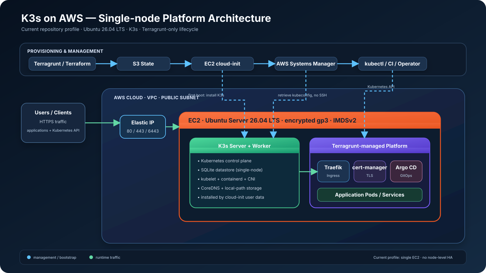

# Architecture diagrams

This directory contains rendered architecture assets used by the repository documentation.

## K3s platform overview

The SVG represents the current repository profile:

- Terragrunt drives Terraform for AWS infrastructure and S3 remote state.
- VPC, EC2 and K3s are separate lifecycle/state boundaries.
- EC2 uses Canonical Ubuntu Server 26.04 LTS, resolved from Canonical's public AWS SSM AMI parameter.
- K3s is installed during EC2 first boot through cloud-init/user data.
- AWS Systems Manager is used for secure kubeconfig retrieval without SSH.
- the single K3s node runs control-plane and workload components.
- K3s bundled Traefik is disabled.
- Traefik, cert-manager and Argo CD are official Helm charts managed as Terraform `helm_release` resources through separate Terragrunt units.
- the current topology is single-node and therefore does not provide node-level high availability.

The SVG is committed as a repository asset so GitHub and downstream documentation render the same reviewed architecture image.

The simpler non-technical AI Factory visual lives at [`../ai-factory/architecture.svg`](../ai-factory/architecture.svg).
