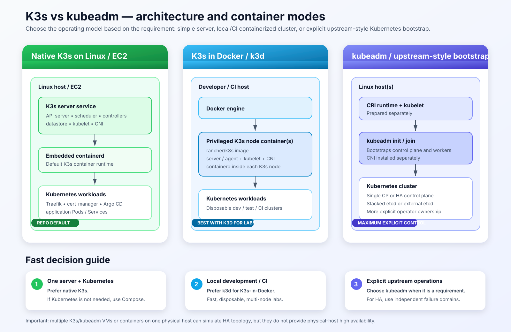

# K3s vs kubeadm — architecture, self-hosted HA, containerized K3s, and distribution choices

This guide explains **what K3s and kubeadm are**, how they differ operationally, which topology fits a single server or a multi-node cluster, how K3s can run natively or inside containers, and which other Kubernetes distributions are worth considering for a serious self-hosted HA platform.

The goal is practical engineering guidance rather than product marketing.

> **Research review:** 2026-09-09. Recommendations were checked against the official K3s, Kubernetes/kubeadm, RKE2, Talos Linux, k0s, MicroK8s, and k3d documentation linked at the end.



For the AWS implementation in this repository, also see:


---

## Executive decision

For this repository and for a typical **small-to-medium self-hosted HA Kubernetes platform**, the default recommendation is:

```text
3 independent Linux servers
        |
        +-- K3s server 1 -- control plane + embedded etcd
        +-- K3s server 2 -- control plane + embedded etcd
        +-- K3s server 3 -- control plane + embedded etcd
        |
        +-- fixed API / registration endpoint
        |
        +-- optional K3s agent nodes when workload capacity grows
```

Why K3s is the default here:

- fully conformant Kubernetes;
- simpler bootstrap and upgrades than a hand-assembled kubeadm platform;
- embedded containerd and sensible networking defaults;
- straightforward three-server HA with embedded etcd;
- lower operational overhead for a small platform team;
- servers can also run workloads, so a small HA cluster can start with only three machines;
- easy evolution from one node -> workers -> three-server HA -> dedicated workers.

K3s is **not universally the best choice**. If security/compliance is the primary requirement, **RKE2** may be a better fit. If you are willing to replace general-purpose Linux administration with an immutable, API-managed Kubernetes operating system, **Talos Linux** is also a very strong production choice.

---

# 1. Start with the requirement, not the tool

## One server only needs to run containers

If the requirement is simply:

- a few containers;
- restart policies;
- environment variables;
- volumes;
- basic networking;
- a reverse proxy;

then **Docker Compose or Podman Compose may be enough**.

Do not introduce Kubernetes only because it is popular. Kubernetes adds an API server, controllers, certificates, RBAC, cluster networking, scheduling, upgrades, and datastore operations. Those capabilities are valuable when you need them, but they are still operational responsibilities.

## One server needs Kubernetes features

Choose **K3s** when you need:

- Deployments and rolling updates;
- Services and Ingress;
- Helm;
- ConfigMaps and Secrets;
- Jobs and CronJobs;
- Kubernetes health probes;
- GitOps with Argo CD;
- cert-manager;
- a future path to multiple nodes without changing the application deployment model.

## The team explicitly wants an upstream kubeadm operating model

Choose **kubeadm** when the requirement is specifically to own more of the Kubernetes assembly process:

- install/configure the CRI runtime yourself;
- select/configure the CNI yourself;
- manage control-plane bootstrap more explicitly;
- standardize on kubeadm-specific runbooks;
- learn upstream control-plane/PKI/bootstrap mechanics;
- deeply customize control-plane components.

---

# 2. The simplest mental model

## K3s

Think of K3s as:

```text
Kubernetes
+ packaging
+ containerd
+ networking defaults
+ datastore choices
+ simpler TLS/bootstrap
+ simpler operations
```

A K3s **server** runs the Kubernetes control plane and datastore. K3s servers also run the agent functionality by default, so they can run application Pods unless you intentionally restrict scheduling.

A K3s **agent** is a worker-only node.

## kubeadm

Think of kubeadm as:

```text
A tool for bootstrapping and joining Kubernetes nodes
```

kubeadm is intentionally not a complete batteries-included distribution. The operator still prepares important surrounding components such as the runtime, Pod networking, HA endpoint, host configuration, and operational procedures.

---

# 3. Single-node architecture

## K3s single node

A single K3s server is a complete Kubernetes cluster:

```text
Linux host
└── K3s server
    ├── kube-apiserver
    ├── controller-manager
    ├── scheduler
    ├── SQLite datastore by default
    ├── kubelet
    ├── containerd
    ├── CNI/networking
    └── workload Pods
```

This is why K3s is such a strong fit for a single server that genuinely needs Kubernetes.

## kubeadm single node

A single-node kubeadm cluster is also valid:

```text
Linux host
├── CRI runtime, e.g. containerd
├── kubelet
├── kubeadm
└── Kubernetes control plane
    ├── kube-apiserver
    ├── controller-manager
    ├── scheduler
    ├── local etcd
    └── CNI installed separately
```

By default, kubeadm control-plane nodes are tainted so ordinary workloads do not schedule there. A one-node kubeadm lab must intentionally remove that control-plane taint if applications are expected to run on the same node.

## Single-node recommendation

| Requirement | Recommendation |
|---|---|
| Only run containers | Docker Compose / Podman Compose |
| Kubernetes required | **K3s** |
| Learn kubeadm mechanics | **kubeadm** |
| CKA/admin bootstrap lab | **kubeadm** is usually more educational |

---

# 4. Multi-node without HA

A multi-node cluster is not automatically highly available.

A common K3s non-HA topology is:

```text
K3s server
control plane + datastore
        |
        +-- K3s agent 1
        +-- K3s agent 2
        +-- K3s agent 3
```

This increases workload capacity and lets Pods spread across machines, but the single K3s server remains a control-plane single point of failure.

If that control-plane node fails, workloads already running on workers may continue for a period, but normal Kubernetes control-loop behavior is impaired:

- API changes are unavailable;
- new Pods cannot be scheduled normally;
- controllers cannot reconcile desired state normally;
- failed workloads may not be replaced as expected;
- cluster administration is unavailable until the server returns.

For a small non-HA cluster, K3s is generally the simpler choice unless kubeadm itself is a requirement.

---

# 5. Best self-hosted HA design for this project

For a professional self-hosted HA cluster, use **three independent physical or cloud failure domains**.

```text
                         Operators / CI / kubectl
                                  |
                       fixed API endpoint / VIP
                                  |
                 +----------------+----------------+
                 |                |                |
          K3s Server 1     K3s Server 2     K3s Server 3
          control plane     control plane     control plane
          embedded etcd     embedded etcd     embedded etcd
          physical host A   physical host B   physical host C
                 |                |                |
                 +---------- etcd quorum ----------+
                                  |
                       optional agent nodes
                                  |
                         application workloads
```

## Why three K3s servers?

K3s embedded-etcd HA requires an **odd number of server nodes**. Three is the normal minimum.

For three servers:

```text
etcd members = 3
quorum       = 2
allowed simultaneous server failures = 1
```

One server can fail and the control plane can still remain available.

Five servers do not automatically make a small cluster more efficient. etcd quorum becomes three, and operational complexity increases. Start with three unless there is a clear design reason for more.

## Why separate physical hosts or failure domains?

This is critical:

```text
one physical server
├── VM control-plane-1
├── VM control-plane-2
└── VM control-plane-3
```

is **not true physical HA**.

All three VMs still share the same:

- motherboard/CPU/RAM;
- power source;
- hypervisor;
- local storage/controller;
- often the same network path.

If the host dies, etcd loses all members at the same time.

Real HA is closer to:

```text
Host A -> K3s server 1
Host B -> K3s server 2
Host C -> K3s server 3
```

and, where possible, separate power/network/storage/cloud availability-zone failure domains.

## Why a fixed API/registration endpoint?

Do not permanently point agents and administrators at one control-plane node's IP.

Use a stable endpoint such as:

```text
api.k3s.example.com
        |
Layer-4 load balancer / VIP
        |
+-------+-------+
|       |       |
CP1     CP2     CP3
```

Possible implementations include:

- kube-vip;
- HAProxy + Keepalived;
- a hardware/network load balancer;
- a cloud TCP load balancer;
- another stable virtual IP design.

The fixed endpoint is used for Kubernetes API access and node registration. It is a separate concern from application ingress.

## Kubernetes API HA and application ingress are different

```text
Kubernetes API
TCP 6443
    |
VIP / L4 LB
    |
K3s server nodes

Application traffic
HTTP 80 / HTTPS 443
    |
LoadBalancer / VIP
    |
Traefik
    |
Services / Pods
```

Do not mix control-plane HA design with application ingress design.

## Storage matters: use SSD/NVMe

etcd is write-intensive and latency-sensitive. K3s documentation recommends SSD-backed storage for good database performance.

For a serious self-hosted cluster, prefer:

- SSD/NVMe;
- stable low-latency disks;
- sufficient IOPS;
- monitoring for disk latency and free space.

Avoid SD cards or slow consumer flash for embedded-etcd production nodes.

## Important K3s HA network ports

At minimum, understand these flows:

| Port | Purpose |
|---|---|
| TCP 6443 | Kubernetes API / K3s supervisor |
| TCP 2379-2380 | embedded etcd traffic between server nodes |
| TCP 10250 | kubelet API/metrics between nodes as required |
| UDP 8472 | Flannel VXLAN when using that backend |

Do not expose internal cluster networking ports such as Flannel VXLAN directly to the public Internet.

## Do you need dedicated workers immediately?

No.

K3s server nodes are schedulable by default, so the smallest true HA cluster can be:

```text
3 physical servers
Each server runs:
- control plane
- etcd
- application workloads
```

This is often the best starting point for a small homelab, private platform, or small production environment.

As workload demand grows, move to:

```text
3 K3s server nodes
control plane + etcd
        |
        +-- N K3s agent nodes
            application workloads
```

You can then taint/restrict server nodes if you want control-plane resources isolated from applications.

## Backup is part of HA

HA is not a backup strategy.

A healthy three-member etcd cluster does not protect you from:

- accidental deletion;
- bad configuration replicated to all members;
- operator error;
- logical corruption;
- security incidents;
- losing an entire site.

For production, add:

- scheduled etcd snapshots;
- off-node/off-site snapshot copies;
- documented restore procedure;
- periodic restore tests.

## Suggested self-hosted progression

```text
Stage 1
1 K3s server
low-cost / dev / small non-HA

        |
        v

Stage 2
3 independent K3s servers
embedded etcd
true control-plane HA
servers also run workloads

        |
        v

Stage 3
3 dedicated K3s servers
+ N K3s agents
workload isolation and scale

        |
        v

Stage 4
multiple failure domains
external/stable ingress
observability
backups/restore testing
centralized secret management
GitOps
```

For many self-hosted environments, **Stage 2 is the best cost/reliability balance**.

---

# 6. Why K3s is preferred over kubeadm for this self-hosted HA use case

Both can build a correct HA Kubernetes cluster. The difference is operational ownership.

| Area | K3s HA | kubeadm HA |
|---|---|---|
| Kubernetes compatibility | Conformant Kubernetes | Upstream Kubernetes |
| Runtime | containerd bundled | CRI runtime prepared separately |
| CNI/default networking | sensible defaults included | selected/installed separately |
| HA datastore | embedded etcd or external DB | stacked etcd or external etcd |
| Three-node HA bootstrap | comparatively simple | more assembly and planning |
| PKI/bootstrap | more automated | more explicit operator ownership |
| Small-team operations | **strong fit** | valid but heavier |
| Deep component customization | good | **excellent** |
| Upstream kubeadm standardization | not kubeadm | **best fit** |

The practical difference is:

```text
K3s:
"I want to operate Kubernetes with fewer moving parts."

kubeadm:
"I want to operate Kubernetes and own more of how Kubernetes is assembled."
```

That extra kubeadm control can be valuable, but it should solve a real requirement rather than become complexity for its own sake.

## Choose kubeadm instead when

Use kubeadm when the organization explicitly needs:

- kubeadm as a platform standard;
- deep control-plane flag customization;
- custom PKI/bootstrap workflows;
- an existing mature kubeadm automation/upgrade/DR practice;
- maximum alignment with upstream kubeadm administrative procedures;
- training environments focused on kubeadm mechanics.

For a small self-hosted platform team, K3s usually lets engineering time go toward application reliability rather than Kubernetes assembly.

---

# 7. K3s vs kubeadm HA topology

## K3s embedded-etcd HA

```text
Fixed API / registration address
              |
      +-------+-------+
      |       |       |
    K3s-1   K3s-2   K3s-3
    CP+etcd  CP+etcd  CP+etcd
```

This is the default recommendation for this repository when HA is required.

## kubeadm stacked-etcd HA

```text
Control-plane endpoint / LB
              |
      +-------+-------+
      |       |       |
     CP1     CP2     CP3
    +etcd   +etcd   +etcd
```

This is a well-established upstream design, but the operator owns more of the surrounding platform setup.

## kubeadm external-etcd HA

```text
Control-plane endpoint / LB
              |
      +-------+-------+
      |       |       |
     CP1     CP2     CP3
              |
      separate etcd cluster
      E1      E2      E3
```

This provides stronger lifecycle separation but requires more machines and another distributed system to operate.

---

# 8. K3s and containers — four concepts people often confuse

The phrase "K3s with Docker" can mean different things.

## Model 1 — native K3s with embedded containerd

This is the normal/default model and the recommended production model for this repository.

```text
Linux / EC2 / bare metal
└── K3s service
    └── containerd
        └── Kubernetes workload containers
```

## Model 2 — native K3s using Docker as the CRI runtime

K3s can use Docker through cri-dockerd.

```text
Linux
├── dockerd
└── K3s
    └── cri-dockerd -> Docker
```

Use this only when there is a concrete reason to use Docker as the Kubernetes node runtime. Embedded containerd is the cleaner default.

## Model 3 — K3s node itself inside Docker

The official `rancher/k3s` image can run a K3s server or agent as a privileged Docker container.

```text
Linux host
└── Docker
    └── privileged K3s node container
        ├── K3s
        ├── kubelet
        ├── containerd
        └── workload containers
```

This is useful for labs, CI, demos, and testing. It adds another privileged containerization layer and is not the preferred long-lived production design here.

## Model 4 — k3d

k3d is purpose-built to run K3s nodes as Docker containers.

```text
Laptop / CI host
└── Docker
    ├── k3d load-balancer container
    ├── K3s server container(s)
    └── K3s agent container(s)
```

For local development or CI, use k3d instead of manually wiring multiple K3s Docker containers.

---

# 9. Direct K3s-in-Docker example

This repository pins K3s to:

```text
v1.36.4+k3s1
```

The Docker image tag uses a hyphen instead of the release `+`:

```text
rancher/k3s:v1.36.4-k3s1
```

Create persistent volumes:

```bash
docker volume create k3s-server-data
docker volume create k3s-server-etc
```

Run a single K3s server container:

```bash
docker run -d \
  --privileged \
  --name k3s-server-1 \
  --hostname k3s-server-1 \
  -p 6443:6443 \
  -v k3s-server-data:/var/lib/rancher/k3s \
  -v k3s-server-etc:/etc/rancher/k3s \
  rancher/k3s:v1.36.4-k3s1 \
  server --disable=traefik
```

The `--disable=traefik` flag mirrors this repository, where Traefik is managed separately through Helm.

Check the container:

```bash
docker ps
docker logs -f k3s-server-1
```

Retrieve kubeconfig:

```bash
mkdir -p ~/.kube
docker cp k3s-server-1:/etc/rancher/k3s/k3s.yaml ~/.kube/k3s-docker.yaml
chmod 600 ~/.kube/k3s-docker.yaml
export KUBECONFIG=~/.kube/k3s-docker.yaml
kubectl get nodes -o wide
```

## Why `--privileged` matters

A containerized Kubernetes node must perform low-level operations involving namespaces, cgroups, mounts, networking, and nested workload containers. A privileged K3s node container must **not** be treated as a strong isolation/security boundary from its Docker host.

That is one reason native K3s is a cleaner production design for dedicated server nodes.

---

# 10. k3d for local development and CI

A local cluster:

```bash
k3d cluster create dev \
  --servers 1 \
  --agents 2 \
  --image rancher/k3s:v1.36.4-k3s1
```

A three-server HA-topology lab:

```bash
k3d cluster create ha-lab \
  --servers 3 \
  --image rancher/k3s:v1.36.4-k3s1
```

Remember: three K3s server containers on one laptop still share one physical failure domain. This tests quorum/topology; it does **not** create real host-level HA.

---

# 11. Native K3s vs containerized K3s for production

| Area | Native K3s | K3s inside Docker |
|---|---|---|
| Operational layers | fewer | extra Docker node layer |
| Privileged node container | no | normally yes |
| systemd/service integration | direct | Docker manages node container |
| Networking | direct host/node networking | extra Docker networking layer |
| Storage | direct host paths | Docker volumes/bind mounts first |
| Local dev portability | lower | higher |
| CI/testing | good | **excellent with k3d** |
| Dedicated production server | **preferred** | usually unnecessary |

Production recommendation for this repository:

```text
physical/cloud server
└── Linux
    └── native K3s
        └── containerd
            └── Pods
```

---

# 12. Are there better Kubernetes distributions than K3s?

There is no universal winner. For self-hosted HA, these are the alternatives worth serious consideration.

## RKE2 — strongest alternative when security/compliance matters

RKE2 is Rancher's/SUSE's enterprise-oriented Kubernetes distribution. It takes much of K3s's simple deployment model while staying closer to upstream Kubernetes conventions and focusing heavily on security/compliance.

Official RKE2 documentation highlights:

- fully conformant Kubernetes;
- hardened-by-default design goals;
- CIS hardening support;
- FIPS 140-2 enablement;
- containerd embedded;
- three-server HA with a fixed registration address and embedded etcd;
- optional agents for application workloads.

### Choose RKE2 when

- the cluster is production-critical and security/compliance is a major requirement;
- CIS/FIPS requirements matter;
- you want Rancher/SUSE integration;
- you want K3s-like operational simplicity but closer alignment with a traditional enterprise Kubernetes model.

### Trade-off

RKE2 is generally heavier than K3s and intentionally targets datacenter/security-focused use cases rather than minimal edge/small-footprint deployment.

### Recommendation

For a regulated or enterprise self-hosted environment, **RKE2 can be a better choice than K3s**.

---

## Talos Linux — strongest alternative for immutable, dedicated Kubernetes nodes

Talos Linux is a Kubernetes-optimized Linux distribution rather than just a Kubernetes installer. It runs on the Kubernetes nodes and hosts both workloads and control-plane components.

Its official design emphasizes:

- API-managed node configuration;
- immutable filesystem;
- minimal packages;
- secure-by-default design;
- declarative lifecycle management;
- bare-metal, VM, and cloud deployment.

The mental model is:

```text
Traditional approach
Ubuntu/RHEL/etc
+ OS package management
+ SSH/system tools
+ Kubernetes distribution

Talos approach
Talos Linux
+ declarative API management
+ Kubernetes
```

### Choose Talos when

- the nodes are dedicated to Kubernetes;
- immutable infrastructure is a priority;
- you want a small node attack surface;
- you are comfortable managing the node through Talos APIs rather than a traditional general-purpose Linux workflow;
- infrastructure-as-code/rebuild-over-repair is already part of your operating model.

### Trade-off

Talos changes the way Linux nodes are operated. That is a strength when the team wants immutable Kubernetes appliances, but a learning/operational change if the team expects normal Linux server administration.

### Recommendation

For a greenfield, dedicated, security-conscious bare-metal HA cluster, **Talos is arguably the most interesting alternative to K3s/RKE2**.

---

## k0s — clean single-binary alternative

k0s is an all-inclusive Kubernetes distribution packaged as a single binary and designed to work across cloud, bare metal, edge, and IoT environments with very few host dependencies.

### Choose k0s when

- you value a very small installation footprint;
- a single-binary Kubernetes distribution is attractive;
- you want another CNCF-certified lightweight distribution option.

### Why it is not the default recommendation here

For this repository, K3s already provides the lightweight/simple operational model we want, while RKE2 and Talos offer clearer differentiated reasons to switch: security/compliance for RKE2, or immutable API-managed nodes for Talos.

---

## MicroK8s — strong Ubuntu-centric option

MicroK8s is Canonical's lightweight Kubernetes distribution. With three or more nodes, HA is automatically enabled and the default HA datastore is dqlite.

### Choose MicroK8s when

- your environment is strongly Ubuntu/Canonical-oriented;
- snap-based lifecycle management fits your platform standards;
- you want very simple multi-node clustering and built-in add-ons;
- dqlite-based HA is acceptable to your team.

### Why it is not the first recommendation here

This repository pins Canonical Ubuntu Server 26.04 LTS through the public SSM AMI parameter and uses snap only as a fallback for the SSM Agent. K3s fits that model because it does not make snap the Kubernetes lifecycle manager.

---

# 13. Practical distribution decision matrix

| Requirement | Recommended option | Why |
|---|---|---|
| One server, Kubernetes required | **K3s** | simplest low-overhead Kubernetes path |
| Small self-hosted HA on standard Linux | **K3s** | 3-server embedded-etcd HA, simple ops |
| Enterprise security/compliance | **RKE2** | CIS/FIPS/security-focused distribution |
| Dedicated immutable Kubernetes appliances | **Talos Linux** | API-managed, immutable, minimal OS |
| Very lightweight single-binary alternative | **k0s** | all-inclusive, low host dependencies |
| Ubuntu/snap-centric platform | **MicroK8s** | simple clustering and automatic HA at 3+ nodes |
| Maximum kubeadm/upstream bootstrap ownership | **kubeadm** | explicit control of more components |
| Local multi-node Kubernetes in Docker | **k3d** | purpose-built K3s-in-Docker workflow |

## My ranking for this repository's goals

For a self-hosted platform focused on practical HA and manageable operations:

```text
1. K3s       -> best default balance of simplicity and HA
2. RKE2      -> better when security/compliance requirements increase
3. Talos     -> better when immutable dedicated Kubernetes nodes are desired
4. kubeadm   -> best when explicit upstream bootstrap ownership is the goal
5. k0s       -> good lightweight alternative
6. MicroK8s  -> good when Ubuntu/Canonical is already the platform standard
```

This ranking is **not a universal quality ranking**. It is a fit ranking for the architecture and operating model represented by this repository.

---

# 14. Final recommendation for this project

For the current AWS/self-hosted platform:

- keep **native K3s on Linux** as the default;
- keep **EC2 and K3s as separate Terraform/Terragrunt lifecycle modules**;
- keep Traefik, cert-manager, and Argo CD managed independently through Helm;
- use **k3d** for local/CI containerized clusters;
- use direct `rancher/k3s` Docker containers only for labs/testing/specialized cases;
- evolve to **3 independent K3s server nodes with embedded etcd** when real HA is required;
- put a stable API/registration endpoint in front of those servers;
- use SSD/NVMe-backed datastore storage;
- add scheduled etcd snapshots and tested restores;
- add dedicated K3s agents only when workload isolation/capacity requires them;
- consider **RKE2** if CIS/FIPS/compliance becomes a primary requirement;
- consider **Talos Linux** for a future greenfield bare-metal platform where immutable/API-managed nodes are desired;
- use kubeadm only when the organization explicitly wants kubeadm/upstream bootstrap ownership.

The design principle is simple:

> Choose the least complex platform that still satisfies availability, security, recovery, and operational-control requirements.

For the present project, that remains **K3s**.

---

# Official research sources

## K3s

- K3s overview: https://docs.k3s.io/
- Architecture: https://docs.k3s.io/architecture
- Quick start: https://docs.k3s.io/quick-start
- Requirements: https://docs.k3s.io/installation/requirements
- HA embedded etcd: https://docs.k3s.io/datastore/ha-embedded
- HA external datastore: https://docs.k3s.io/datastore/ha
- Cluster load balancer: https://docs.k3s.io/datastore/cluster-loadbalancer
- Cluster datastore: https://docs.k3s.io/datastore
- Server reference: https://docs.k3s.io/cli/server
- Running K3s in Docker / advanced options: https://docs.k3s.io/advanced

## kubeadm / Kubernetes

- Creating a cluster with kubeadm: https://kubernetes.io/docs/setup/production-environment/tools/kubeadm/create-cluster-kubeadm/
- kubeadm HA: https://kubernetes.io/docs/setup/production-environment/tools/kubeadm/high-availability/
- kubeadm HA etcd: https://kubernetes.io/docs/setup/production-environment/tools/kubeadm/setup-ha-etcd-with-kubeadm/
- kubeadm implementation details: https://kubernetes.io/docs/reference/setup-tools/kubeadm/implementation-details/

## RKE2

- RKE2 overview: https://docs.rke2.io/
- RKE2 HA: https://docs.rke2.io/install/ha
- CIS hardening: https://docs.rke2.io/security/hardening_guide
- FIPS support: https://docs.rke2.io/security/fips_support

## Talos Linux

- What is Talos Linux: https://docs.siderolabs.com/talos/v1.14/overview/what-is-talos
- Production clusters: https://docs.siderolabs.com/talos/v1.14/getting-started/prodnotes

## k0s

- k0s documentation: https://docs.k0sproject.io/
- Installation: https://docs.k0sproject.io/stable/install/

## MicroK8s

- MicroK8s documentation: https://canonical.com/microk8s/docs
- High availability: https://canonical.com/microk8s/docs/high-availability

## k3d

- k3d: https://k3d.io/
- k3d CLI: https://k3d.io/stable/usage/commands/k3d/
