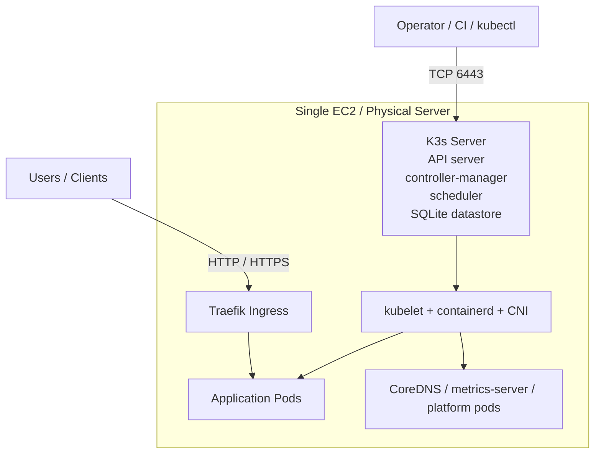
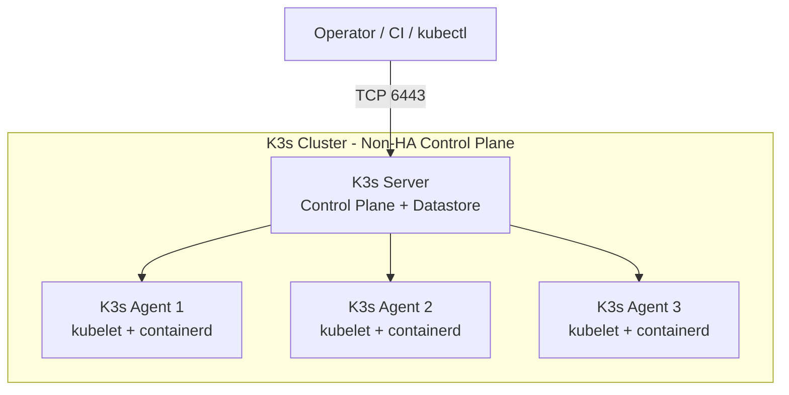
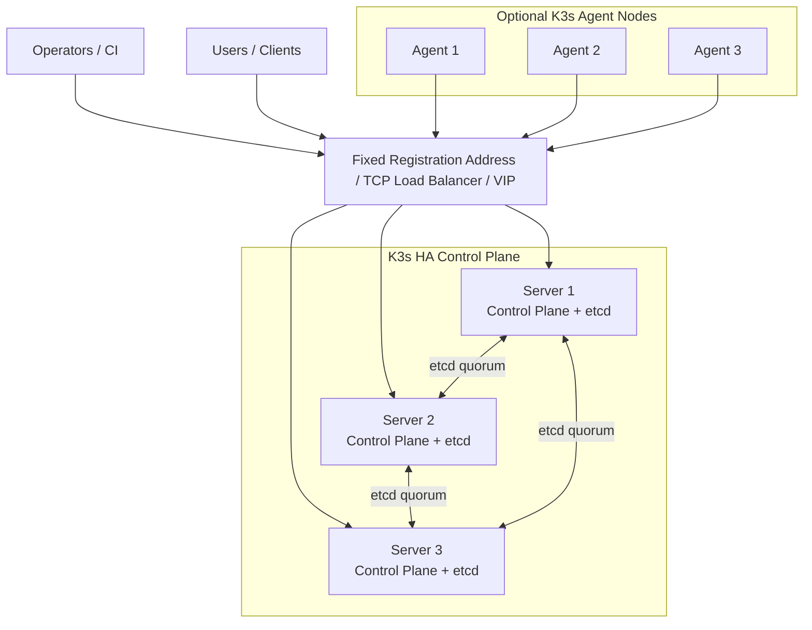
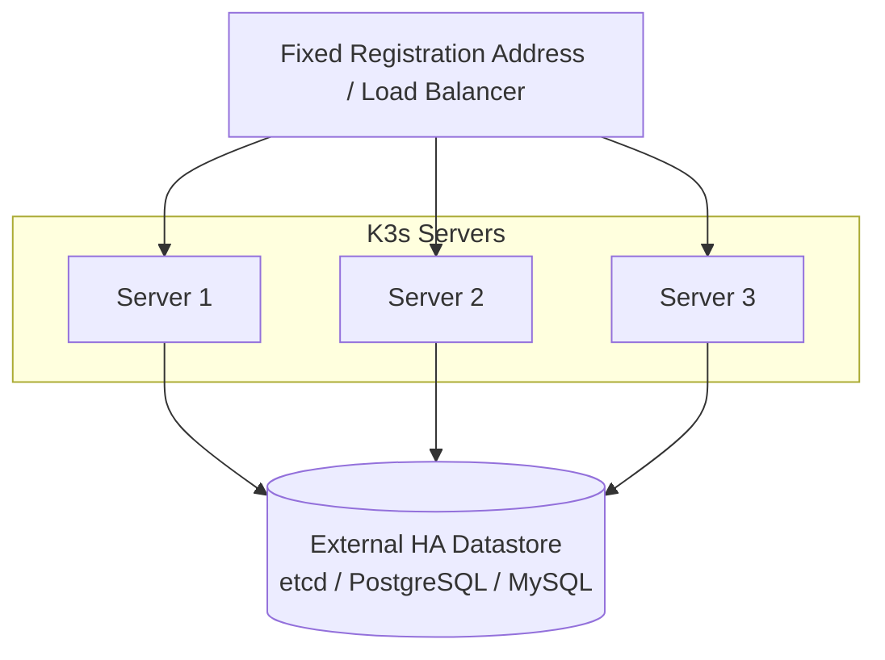
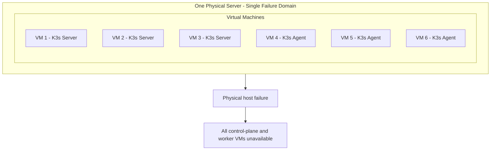
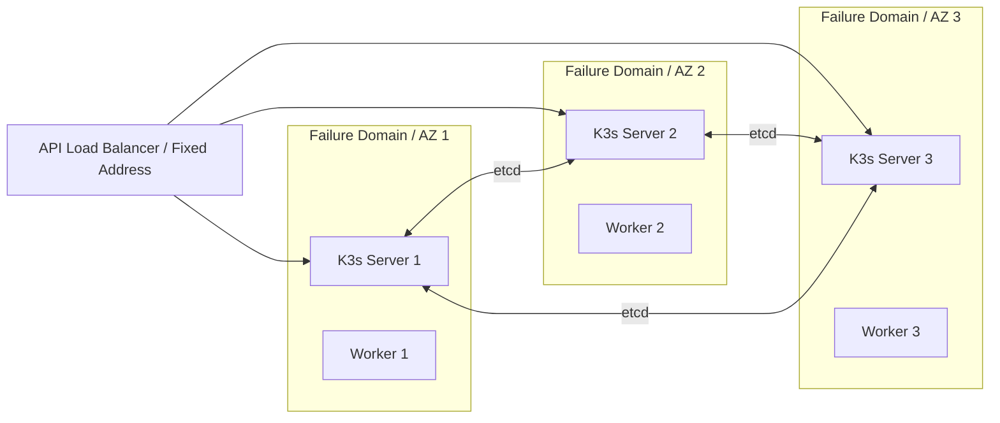

# K3s architecture patterns

The diagrams in this document are Mermaid diagrams, so GitHub renders them as architecture images while keeping the source version-controlled and reviewable.

## 1. Single-node K3s

A single K3s server runs both control-plane components and application workloads. K3s uses an embedded SQLite datastore by default for a single-server cluster.

### Characteristics

- lowest infrastructure cost;
- easiest Kubernetes topology to operate;
- server also runs workloads;
- no control-plane HA;
- host failure takes the entire cluster offline.

### Best fit

- development and staging;
- internal services;
- small production workloads where downtime is acceptable;
- one-server deployments that genuinely need Kubernetes APIs, Helm, Ingress, Secrets, Deployments, Jobs, and related features.

## 2. Multi-node K3s without HA

One K3s server owns the control plane and datastore while one or more K3s agents run workloads.

### Characteristics

- workloads can be distributed across several machines;
- worker capacity can grow independently;
- the single server remains a control-plane single point of failure;
- existing workloads may continue running for a period during a control-plane outage, but scheduling, reconciliation, API operations, and cluster changes are unavailable until the server returns.

### Best fit

- dev/staging clusters with multiple workers;
- workloads requiring more compute than one node;
- environments where control-plane downtime is acceptable.

## 3. K3s HA with embedded etcd

For embedded-etcd HA, K3s requires an odd number of server nodes, with three being the normal minimum. Each server runs control-plane services and an etcd member.

### Quorum

With three embedded-etcd server nodes, quorum is two. The cluster can tolerate one server failure and retain control-plane availability.

The servers should run on **separate failure domains**. Three VMs on one physical machine do not provide physical-host HA.

### Best fit

- self-managed production Kubernetes where control-plane availability matters;
- small/medium clusters where a simpler operational model is preferred;
- environments where three independent servers are available.

## 4. K3s HA with an external datastore

K3s can also use an external etcd, MySQL/MariaDB, or PostgreSQL datastore. This separates datastore lifecycle from K3s server lifecycle but adds another critical distributed system to operate.

Use this topology only when there is a clear reason to manage the datastore independently. Embedded etcd is usually the simpler K3s HA starting point.

## 5. Multiple VMs on one physical server

This topology can emulate a multi-node cluster, but it is **not true HA** because every VM shares the same physical failure domain.

### Appropriate use

- learning K3s HA mechanics;
- CKA/CKS-style labs;
- testing cluster automation;
- validating etcd quorum and node-join procedures.

### Not appropriate as

- production HA;
- host-failure resilience;
- availability-zone resilience.

## 6. Production failure-domain model

A genuine HA design places control-plane nodes on separate physical hosts or availability zones.

The repository currently deploys the single-node profile. Moving to HA should create multiple independent EC2 instances and distribute them across failure domains; creating several VMs on the same EC2 instance would not satisfy the HA objective.

## Sources

- https://docs.k3s.io/architecture
- https://docs.k3s.io/datastore/ha-embedded
- https://docs.k3s.io/datastore/ha
- https://docs.k3s.io/datastore/cluster-loadbalancer
